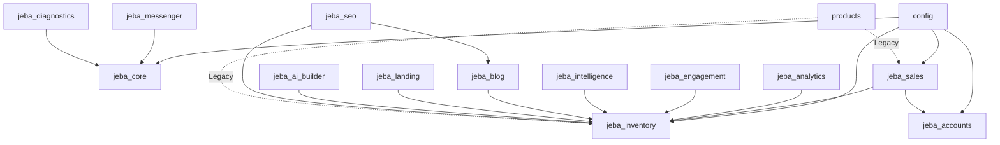

# Jeba Enterprise - Code Structure

> **Last Updated:** 2026-01-11  
> **Root Path:** `e:\WebProjects\jebaenterprise`

---

## Directory Tree with Descriptions

```
jebaenterprise/
│
├── .env                           # Environment variables (secrets, DB config)
├── .gitignore                     # Git ignore patterns
├── manage.py                      # Django management CLI entry point
├── requirements.txt               # Python dependencies (pip freeze format)
│
├── config/                        # ─── Django Project Configuration ───
│   ├── __init__.py
│   ├── settings.py               # Main settings: apps, middleware, database, auth
│   ├── urls.py                   # Root URL router - connects all app URLs
│   ├── wsgi.py                   # WSGI entry point for Gunicorn/Waitress
│   └── asgi.py                   # ASGI entry point (if async needed)
│
├── templates/                     # ─── Base Templates (Project-Level) ───
│   └── base.html                 # Master template inherited by all apps
│
├── staticfiles/                   # ─── Collected Static Files (Production) ───
│                                  # (Generated by collectstatic command)
│
├── media/                         # ─── User-Uploaded Files ───
│   ├── products/                 # Product images
│   ├── blog/                     # Blog featured images
│   ├── ai_builder/               # AI page reference images
│   └── site/branding/            # Logo, favicon uploads
│
├── locale/                        # ─── i18n Translation Files ───
│   ├── en/                       # English translations
│   └── bn/                       # Bengali translations
│
├── geoip/                         # ─── GeoIP Database ───
│   └── GeoLite2-City.mmdb        # MaxMind city-level geolocation
│
├── sessions/                      # ─── Session Storage (File-Based) ───
│
├── venv/                          # ─── Python Virtual Environment ───
│
│
│  ╔═══════════════════════════════════════════════════════════════════╗
│  ║                     CORE DJANGO APPLICATIONS                       ║
│  ╚═══════════════════════════════════════════════════════════════════╝
│
├── jeba_core/                     # ─── Core Configuration & Utilities ───
│   ├── __init__.py
│   ├── apps.py                   # App config: JebaCoreConfig
│   ├── models.py                 # SiteSettings (singleton) - branding, payments, social
│   ├── admin.py                  # SiteSettings admin interface
│   ├── views.py                  # Error handlers (404, 500, maintenance)
│   ├── middleware.py             # MaintenanceModeMiddleware
│   ├── context_processors.py     # global_settings() - injects SiteSettings to all templates
│   ├── image_optimizer.py        # optimize_image(), generate_lqip() - image compression
│   ├── template_filters.py       # Custom template tags (if any)
│   ├── migrations/
│   └── templates/jeba_core/
│       ├── maintenance.html      # Maintenance mode page
│       ├── 404.html              # Custom 404 error page
│       └── 500.html              # Custom 500 error page
│
├── jeba_inventory/                # ─── Product Catalog Management ───
│   ├── __init__.py
│   ├── apps.py                   # App config: JebaInventoryConfig
│   ├── models.py                 # Product, Category, Tag, ProductVariant, ProductImage
│   │                             # ProductVariation (legacy), import helpers
│   ├── admin.py                  # ProductAdmin with inlines, category admin
│   ├── views.py                  # Product list, detail, search views
│   ├── forms.py                  # Product forms for admin
│   ├── resources.py              # Import/export resources (django-import-export)
│   ├── migrations/
│   ├── static/css/               # Product-specific styles
│   └── templates/jeba_inventory/
│       ├── product_list.html     # Category/search results grid
│       ├── product_detail.html   # Product page with gallery, variants
│       └── admin/                # Custom admin templates
│
├── jeba_sales/                    # ─── Sales & Order Processing ───
│   ├── __init__.py
│   ├── apps.py                   # App config: JebaSalesConfig
│   ├── models.py                 # Sale, SaleItem, Coupon
│   ├── admin.py                  # SaleAdmin with SaleItem inlines
│   ├── views.py                  # Cart, checkout, order detail views
│   ├── forms.py                  # CheckoutForm, payment validation
│   ├── steadfast.py              # Courier API integration (Steadfast/Packzy)
│   ├── migrations/
│   └── templates/jeba_sales/
│       ├── cart.html             # Shopping cart page
│       ├── checkout.html         # Checkout form with payment selection
│       ├── order_detail.html     # Order confirmation & tracking
│       └── order_history.html    # User's order list
│
├── jeba_accounts/                 # ─── User Authentication & Profiles ───
│   ├── __init__.py
│   ├── apps.py                   # App config: JebaAccountsConfig
│   ├── models.py                 # UserProfile (extends Django User)
│   ├── admin.py                  # UserProfile admin
│   ├── views.py                  # Login, register, dashboard, password reset
│   ├── forms.py                  # ProfileForm, RegistrationForm
│   ├── urls.py                   # Account-specific routes
│   ├── utils.py                  # Email helpers, validation
│   ├── migrations/
│   └── templates/jeba_accounts/
│       ├── login.html
│       ├── register.html
│       ├── dashboard.html        # User hub with order/address management
│       └── password_reset*.html  # Password reset flow templates
│
├── jeba_analytics/                # ─── User Behavior & Business Analytics ───
│   ├── __init__.py
│   ├── apps.py                   # App config: JebaAnalyticsConfig
│   ├── models.py                 # SearchEvent, ProductEvent, SessionTrace, DailyAdSpend
│   ├── admin.py                  # Analytics admin views
│   ├── views.py                  # Analytics dashboard, reports
│   ├── middleware.py             # AnalyticsMiddleware - auto-tracks page views
│   ├── analytics_service.py      # Business logic for analytics processing
│   ├── utils.py                  # Helper functions
│   ├── urls.py
│   ├── migrations/
│   └── templates/jeba_analytics/
│       └── dashboard.html        # Admin analytics dashboard
│
├── jeba_engagement/               # ─── Customer Engagement Features ───
│   ├── __init__.py
│   ├── apps.py                   # App config: JebaEngagementConfig
│   ├── models.py                 # Review (1-5 stars), Wishlist
│   ├── admin.py
│   ├── views.py                  # Review submission, wishlist toggle
│   ├── migrations/
│   └── templates/jeba_engagement/
│       └── wishlist.html
│
├── jeba_intelligence/             # ─── Competitor Intelligence & Scraping ───
│   ├── __init__.py
│   ├── apps.py                   # App config: JebaIntelligenceConfig
│   ├── models.py                 # CompetitorPrice, ScraperPreset
│   ├── admin.py
│   ├── views.py                  # Scraper UI, results display
│   ├── scraper.py                # Playwright-based Daraz scraper
│   │                             # Uses thefuzz + imagehash for hybrid matching
│   ├── urls.py
│   ├── migrations/
│   └── templates/jeba_intelligence/
│       └── admin_scraper.html    # Admin scraper interface
│
├── jeba_blog/                     # ─── Content Marketing & Blog ───
│   ├── __init__.py
│   ├── apps.py                   # App config: JebaBlogConfig
│   ├── models.py                 # BlogPost with SEO fields, product linking
│   ├── admin.py                  # Rich text editor integration
│   ├── views.py                  # Blog list, detail, category views
│   ├── urls.py
│   ├── migrations/
│   └── templates/jeba_blog/
│       ├── blog_list.html
│       └── blog_detail.html
│
├── jeba_landing/                  # ─── Marketing Landing Pages & Campaigns ───
│   ├── __init__.py
│   ├── apps.py                   # App config: JebaLandingConfig
│   ├── models.py                 # Campaign, CampaignVariant, LandingSection
│   │                             # VisitorSession, ConversionEvent (analytics)
│   ├── admin.py                  # Campaign builder admin
│   ├── views.py                  # Landing page renderer, A/B variant selection
│   ├── urls.py
│   ├── migrations/
│   ├── static/css/
│   │   └── landing_page.css      # Landing page specific styles
│   └── templates/jeba_landing/
│       ├── landing_base.html     # Base template for landing pages
│       ├── landing_page.html     # Main landing page renderer
│       ├── campaign_list.html    # Campaign overview
│       └── sections/             # Modular section templates
│           ├── hero_carousel.html
│           ├── features.html
│           ├── testimonials.html
│           └── faq.html
│
├── jeba_ai_builder/               # ─── AI-Powered Landing Page Generator ───
│   ├── __init__.py
│   ├── apps.py                   # App config: JebaAiBuilderConfig
│   ├── models.py                 # AIPage, PageConversation, PageVersion
│   ├── admin.py
│   ├── views.py                  # AI chat interface, page preview
│   ├── ai_service.py             # Gemini API integration for page generation
│   ├── urls.py
│   ├── migrations/
│   └── templates/jeba_ai_builder/
│       └── builder.html          # Conversational page builder UI
│
├── jeba_messenger/                # ─── Facebook Messenger Integration ───
│   ├── __init__.py
│   ├── apps.py                   # App config: JebaMessengerConfig
│   ├── models.py                 # Conversation, Message, AISuggestion, MessengerSettings
│   ├── admin.py
│   ├── views.py                  # Webhook handler, chat dashboard
│   ├── ai_responder.py           # Gemini-powered response suggestions
│   ├── webhook.py                # Facebook Webhook verification & events
│   ├── urls.py
│   ├── migrations/
│   └── templates/jeba_messenger/
│       └── chat_dashboard.html   # Admin inbox with AI copilot
│
├── jeba_seo/                      # ─── SEO Management & Optimization ───
│   ├── __init__.py
│   ├── apps.py                   # App config: JebaSeoConfig
│   ├── models.py                 # GlobalSEOSettings, StaticPageSEO
│   ├── admin.py
│   ├── views.py                  # robots.txt handler, SEO dashboard
│   ├── sitemaps.py               # ProductSitemap, CategorySitemap, BlogPostSitemap
│   ├── urls.py
│   ├── migrations/
│   └── templates/jeba_seo/
│
├── jeba_diagnostics/              # ─── Performance Monitoring & Testing ───
│   ├── __init__.py
│   ├── apps.py                   # App config: JebaDiagnosticsConfig
│   ├── models.py                 # PageReport (performance metrics)
│   ├── admin.py
│   ├── views.py                  # Page speed tester UI
│   ├── analyzer.py               # Performance analysis logic
│   ├── urls.py
│   ├── migrations/
│   └── templates/jeba_diagnostics/
│       └── diagnostics_home.html # Performance testing dashboard
│
│
│  ╔═══════════════════════════════════════════════════════════════════╗
│  ║                      LEGACY APPLICATION                            ║
│  ╚═══════════════════════════════════════════════════════════════════╝
│
├── products/                      # ─── Legacy/Routing App (Being Deprecated) ───
│   ├── __init__.py
│   ├── apps.py
│   ├── admin.py                  # Complex 16KB admin (Product management)
│   ├── forms.py                  # Checkout forms
│   ├── urls.py                   # Main URL routing (includes all apps)
│   ├── utils.py                  # Utility functions (12KB)
│   ├── views.py                  # View functions
│   ├── steadfast.py              # Courier integration
│   ├── marketing.py              # Marketing utilities
│   ├── middleware.py
│   ├── context_processors.py
│   ├── migrations/               # 39 migration files
│   ├── management/commands/      # Custom management commands
│   └── templates/                # 34 template files
│
│
│  ╔═══════════════════════════════════════════════════════════════════╗
│  ║                      DOCUMENTATION & MISC                          ║
│  ╚═══════════════════════════════════════════════════════════════════╝
│
├── FEATURES.md                    # Master feature registry with checklist
├── info.md                        # Development progress journal
├── Refactoring_Blueprint.md       # Architecture evolution plan
├── Refactoring_journal.md         # Refactoring progress notes
│
├── deploymentnotes/               # ─── Deployment Documentation ───
│   └── landing_analytic_deployment.md
│
├── help/                          # ─── Developer Help Files ───
│   └── How to add test for new features.md
│
├── backup_landing.json            # Landing page backup data
├── product_details.csv            # Product import data (260KB)
└── jebaenterprise.log             # Application log file (2.1MB)
```

---

## File Count Summary

| Category                | Count                     |
| ----------------------- | ------------------------- |
| **Django Apps**         | 14 (13 active + 1 legacy) |
| **Python Files**        | ~163                      |
| **Template Files**      | 50+                       |
| **Migration Files**     | 39+ (products) + per-app  |
| **Static CSS Files**    | ~10                       |
| **Documentation Files** | 8                         |

---

## Key Configuration Files

| File                 | Purpose                                      |
| -------------------- | -------------------------------------------- |
| `config/settings.py` | Main Django configuration (381 lines)        |
| `config/urls.py`     | Root URL routing (58 lines)                  |
| `.env`               | Environment variables (1KB) - **NOT IN GIT** |
| `.gitignore`         | Git exclusion rules                          |
| `requirements.txt`   | Python dependencies (4.5KB, ~110 packages)   |

---

## App Dependency Graph



**Legend:**

- Solid arrows: Direct model imports
- Dashed arrows: Legacy connections (deprecated)
