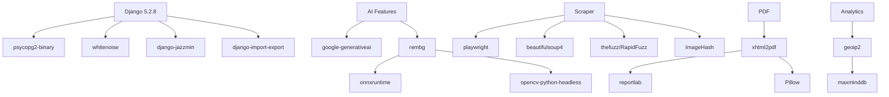

# Jeba Enterprise - Dependencies

> **Last Updated:** 2026-01-11  
> **Total Packages:** ~110  
> **Python Version:** 3.10+ (inferred from package requirements)

---

## Installation

```bash
pip install -r requirements.txt
```

---

## Dependencies by Category

### 1. Core Framework & Web Server

| Package      | Version | Purpose                                      |
| ------------ | ------- | -------------------------------------------- |
| `Django`     | 5.2.8   | Web framework - core of the application      |
| `gunicorn`   | 21.2.0  | Production WSGI server                       |
| `waitress`   | latest  | Windows-compatible WSGI server alternative   |
| `asgiref`    | 3.10.0  | ASGI reference implementation (Django async) |
| `whitenoise` | latest  | Static file serving with compression         |

### 2. Database

| Package           | Version | Purpose                                      |
| ----------------- | ------- | -------------------------------------------- |
| `psycopg2`        | 2.9.11  | PostgreSQL adapter (production)              |
| `psycopg2-binary` | 2.9.11  | PostgreSQL adapter (development/precompiled) |
| `dj-database-url` | 3.0.1   | Parse database URL from environment          |
| `sqlparse`        | 0.5.3   | SQL query parsing (Django dependency)        |

### 3. Configuration & Environment

| Package         | Version | Purpose                                |
| --------------- | ------- | -------------------------------------- |
| `python-dotenv` | 1.2.1   | Load `.env` file environment variables |
| `PyYAML`        | 6.0.3   | YAML parsing for configuration files   |

### 4. Admin & UI Enhancements

| Package                | Version  | Purpose                                  |
| ---------------------- | -------- | ---------------------------------------- |
| `django-jazzmin`       | 3.0.1    | Modern dark theme admin interface        |
| `django-import-export` | 4.3.14   | Excel/CSV import/export in admin         |
| `tablib`               | 3.9.0    | Data format handling (import-export dep) |
| `diff-match-patch`     | 20241021 | Text diff algorithms                     |

### 5. AI & Machine Learning

| Package                        | Version | Purpose                            |
| ------------------------------ | ------- | ---------------------------------- |
| `google-generativeai`          | 0.8.5   | Google Gemini API client           |
| `google-ai-generativelanguage` | 0.6.15  | Gemini underlying language library |
| `google-api-core`              | 2.28.1  | Google API core utilities          |
| `google-api-python-client`     | 2.187.0 | Google APIs general client         |
| `google-auth`                  | 2.43.0  | Google authentication              |
| `google-auth-httplib2`         | 0.2.1   | Google auth HTTP transport         |
| `googleapis-common-protos`     | 1.72.0  | Google APIs protocol buffers       |

### 6. Web Scraping & Browser Automation

| Package          | Version | Purpose                               |
| ---------------- | ------- | ------------------------------------- |
| `playwright`     | 1.56.0  | Browser automation (Daraz scraping)   |
| `beautifulsoup4` | 4.14.2  | HTML/XML parsing                      |
| `soupsieve`      | 2.8     | CSS selector implementation (BS4 dep) |
| `lxml`           | 6.0.2   | Fast XML/HTML processing              |
| `requests`       | 2.32.5  | HTTP client library                   |
| `aiohttp`        | 3.13.2  | Async HTTP client                     |

### 7. Image Processing

| Package                  | Version   | Purpose                                  |
| ------------------------ | --------- | ---------------------------------------- |
| `Pillow`                 | 12.0.0    | Image manipulation (resize, optimize)    |
| `ImageHash`              | 4.3.2     | Perceptual image hashing (visual search) |
| `rembg`                  | 2.0.68    | AI background removal                    |
| `opencv-python-headless` | 4.12.0.88 | Computer vision (headless server)        |
| `scikit-image`           | 0.25.2    | Image processing algorithms              |
| `PyMatting`              | 1.1.14    | Alpha matting for rembg                  |
| `ImageIO`                | 2.37.2    | Image I/O operations                     |

### 8. Text Processing & Matching

| Package           | Version | Purpose                                  |
| ----------------- | ------- | ---------------------------------------- |
| `thefuzz`         | 0.22.1  | Fuzzy string matching (product matching) |
| `RapidFuzz`       | 3.14.3  | Fast fuzzy matching backend              |
| `python-bidi`     | 0.6.7   | Bidirectional text support               |
| `arabic-reshaper` | 3.0.0   | Arabic text reshaping                    |

### 9. PDF Generation

| Package       | Version | Purpose                           |
| ------------- | ------- | --------------------------------- |
| `xhtml2pdf`   | 0.2.17  | HTML to PDF conversion (invoices) |
| `reportlab`   | 4.4.5   | PDF generation library            |
| `pypdf`       | 6.3.0   | PDF manipulation                  |
| `svglib`      | 1.6.0   | SVG to ReportLab conversion       |
| `rlPyCairo`   | 0.4.0   | Cairo graphics for reportlab      |
| `pycairo`     | 1.29.0  | Cairo graphics bindings           |
| `freetype-py` | 2.5.1   | FreeType font bindings            |

### 10. GeoIP & Location

| Package     | Version | Purpose                 |
| ----------- | ------- | ----------------------- |
| `geoip2`    | 5.2.0   | GeoIP database reader   |
| `maxminddb` | 3.0.0   | MaxMind database format |

### 11. Cryptography & Security

| Package                 | Version | Purpose                       |
| ----------------------- | ------- | ----------------------------- |
| `cryptography`          | 46.0.3  | SSL/TLS and crypto operations |
| `pyHanko`               | 0.31.0  | PDF digital signatures        |
| `pyhanko-certvalidator` | 0.29.0  | Certificate validation        |
| `asn1crypto`            | 1.5.1   | ASN.1 types and parsing       |
| `oscrypto`              | 1.3.0   | TLS implementation            |
| `cffi`                  | 2.0.0   | C Foreign Function Interface  |
| `pycparser`             | 2.23    | C parser for cffi             |

### 12. Data Validation & Serialization

| Package                     | Version  | Purpose                      |
| --------------------------- | -------- | ---------------------------- |
| `pydantic`                  | 2.12.5   | Data validation (type hints) |
| `pydantic_core`             | 2.41.5   | Pydantic core implementation |
| `jsonschema`                | 4.25.1   | JSON Schema validation       |
| `jsonschema-specifications` | 2025.9.1 | JSON Schema specs            |
| `annotated-types`           | 0.7.0    | Type annotation extensions   |
| `typing_extensions`         | 4.15.0   | Backported typing features   |
| `typing-inspection`         | 0.4.2    | Runtime type inspection      |

### 13. Async & Networking

| Package            | Version | Purpose                        |
| ------------------ | ------- | ------------------------------ |
| `aiohappyeyeballs` | 2.6.1   | Async happy eyeballs algorithm |
| `aiosignal`        | 1.4.0   | Async signal handlers          |
| `frozenlist`       | 1.8.0   | Frozen list implementation     |
| `yarl`             | 1.22.0  | URL handling for aiohttp       |
| `multidict`        | 6.7.0   | Multivalue dict for HTTP       |
| `propcache`        | 0.4.1   | Property caching               |
| `pyee`             | 13.0.0  | Event emitter (playwright dep) |

### 14. Scientific Computing

| Package      | Version    | Purpose                  |
| ------------ | ---------- | ------------------------ |
| `numpy`      | 2.2.6      | Numerical arrays         |
| `scipy`      | 1.16.3     | Scientific computing     |
| `numba`      | 0.62.1     | JIT compiler for NumPy   |
| `llvmlite`   | 0.45.1     | LLVM wrapper for Numba   |
| `sympy`      | 1.14.0     | Symbolic mathematics     |
| `mpmath`     | 1.3.0      | Arbitrary precision math |
| `networkx`   | 3.5        | Graph algorithms         |
| `PyWavelets` | 1.9.0      | Wavelet transforms       |
| `tifffile`   | 2025.10.16 | TIFF file handling       |

### 15. ONNX & Neural Networks

| Package       | Version | Purpose                      |
| ------------- | ------- | ---------------------------- |
| `onnxruntime` | 1.23.2  | ONNX model inference (rembg) |
| `flatbuffers` | 25.9.23 | Serialization format         |

### 16. gRPC & Protocol Buffers

| Package         | Version | Purpose                    |
| --------------- | ------- | -------------------------- |
| `grpcio`        | 1.76.0  | gRPC framework             |
| `grpcio-status` | 1.71.2  | gRPC status codes          |
| `protobuf`      | latest  | Protocol Buffers           |
| `proto-plus`    | 1.26.1  | Protocol buffer extensions |

### 17. HTTP & Authentication

| Package              | Version    | Purpose                        |
| -------------------- | ---------- | ------------------------------ |
| `urllib3`            | 2.5.0      | HTTP client library            |
| `httplib2`           | 0.31.0     | HTTP client (Google APIs)      |
| `certifi`            | 2025.11.12 | CA bundle                      |
| `charset-normalizer` | 3.4.4      | Encoding detection             |
| `idna`               | 3.11       | Internationalized domain names |
| `pyasn1`             | 0.6.1      | ASN.1 types                    |
| `pyasn1_modules`     | 0.4.2      | ASN.1 module definitions       |
| `rsa`                | 4.9.1      | RSA encryption                 |
| `cachetools`         | 6.2.2      | Cache implementations          |

### 18. Utilities

| Package         | Version | Purpose                    |
| --------------- | ------- | -------------------------- |
| `attrs`         | 25.4.0  | Class decorators           |
| `packaging`     | 25.0    | Version parsing            |
| `platformdirs`  | 4.5.0   | Platform directories       |
| `pooch`         | 1.8.2   | Data file downloading      |
| `colorama`      | 0.4.6   | Terminal colors (Windows)  |
| `coloredlogs`   | 15.0.1  | Colored log formatting     |
| `humanfriendly` | 10.0    | Human-readable formatting  |
| `tqdm`          | 4.67.1  | Progress bars              |
| `six`           | 1.17.0  | Python 2/3 compatibility   |
| `greenlet`      | 3.2.4   | Lightweight threads        |
| `lazy_loader`   | 0.4     | Lazy module loading        |
| `pyparsing`     | 3.2.5   | Parsing library            |
| `rpds-py`       | 0.29.0  | Persistent data structures |
| `referencing`   | 0.37.0  | Reference resolution       |

### 19. HTML/CSS Processing

| Package        | Version | Purpose               |
| -------------- | ------- | --------------------- |
| `html5lib`     | 1.1     | HTML5 parser          |
| `webencodings` | 0.5.1   | Web encoding handling |
| `cssselect2`   | 0.8.0   | CSS selectors         |
| `tinycss2`     | 1.5.0   | CSS parser            |

### 20. Time & Timezone

| Package   | Version | Purpose                  |
| --------- | ------- | ------------------------ |
| `tzdata`  | 2025.2  | Timezone database        |
| `tzlocal` | 5.3.1   | Local timezone detection |

### 21. URL & URI Handling

| Package       | Version | Purpose                |
| ------------- | ------- | ---------------------- |
| `uritemplate` | 4.2.0   | URI template expansion |
| `uritools`    | 5.0.0   | URI parsing            |

### 22. Console & Terminal

| Package       | Version | Purpose                  |
| ------------- | ------- | ------------------------ |
| `pyreadline3` | 3.5.4   | Windows readline support |

---

## Dependency Graph (Critical Paths)



---

## Optional Dependencies

These packages may be needed for specific features:

| Package              | Feature             | Installation          |
| -------------------- | ------------------- | --------------------- |
| `playwright`         | Playwright browsers | `playwright install`  |
| `GeoLite2-City.mmdb` | GeoIP               | Download from MaxMind |

---

## Potential Alternatives

| Current               | Alternative    | Notes                    |
| --------------------- | -------------- | ------------------------ |
| `psycopg2-binary`     | `psycopg` (v3) | Modern async support     |
| `gunicorn`            | `uvicorn`      | For ASGI deployment      |
| `xhtml2pdf`           | `weasyprint`   | Better CSS support       |
| `google-generativeai` | `openai`       | Different LLM provider   |
| `thefuzz`             | `fuzzywuzzy`   | Older version (same API) |

---

## Security Notes

> ⚠️ **Important:** Keep dependencies updated regularly to patch security vulnerabilities.

```bash
# Check for security updates
pip list --outdated

# Upgrade all packages
pip install --upgrade -r requirements.txt
```

---

## Version Constraints

Most packages are pinned to exact versions. Key version requirements:

- **Python:** 3.10+ (for Django 5.2 and type hints)
- **PostgreSQL:** 12+ (for Django 5.2 features)
- **Node.js:** Not required (no frontend build system)
